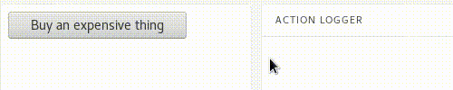

# react-button-with-warning
A react button component with a warning when clicked

## Demo




## Installation

```sh
npm install react-button-with-warning
```


## Usage

```js
import ButtonWithWarning from 'react-button-with-warning';


<ButtonWithWarning onClick={() => { console.log("I've been clicked"); }}>
  Buy an expensive thing
</ButtonWithWarning>
```
